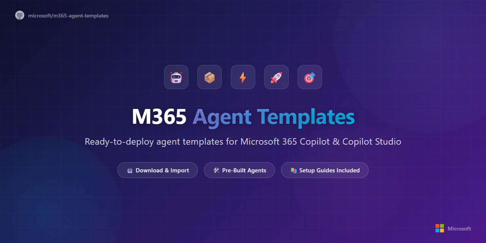

  

  <strong>Pre-built, deploy-ready AI agents for Microsoft 365</strong> 
  Built by the Copilot Agents &amp; Platform Experiences (CAPE) team at Microsoft

---

## 💡 What Are Agent Templates?

Agent templates are **pre-configured, deploy-ready AI agents** for Microsoft 365 designed to address common workplace scenarios — from daily planning to policy lookup to request tracking to customer research. Each template ships as a complete package that you can deploy in minutes or customize to fit your organization's needs.

This repository includes two types of agents:

- **Declarative Agents (DAs)** — Lightweight agents that run inside Microsoft 365 Copilot, grounded in your organization's data (SharePoint, email, Teams, calendar, and more). No custom code or Copilot Studio license required.
- **Custom Agents (CAs)** — Full-featured agents built in Copilot Studio with topics, Power Automate flows, and connector integrations for more complex workflows.

### 📦 What's Included with Each Agent

Each agent folder contains a full **Bill of Materials (BOM)**:

| Asset | Description |
|:------|:------------|
| 📊 **Overview Deck** | Scenario overview, architecture, personas, and demo prompts |
| 📘 **Setup Guide** | Step-by-step deployment instructions tailored to the agent's platform |
| 🧪 **Evaluation Test Plan** | Test scenarios with expected results and pass/fail criteria |
| 📦 **Agent Package (.zip)** | Pre-built package ready to deploy |
| 📂 **Sample Files** | Sample data files for testing (where applicable) |

---

## 🤖 Available Agents

<table>
<tr>
<td align="center" width="100">
 
</td>
<td>

### [Plan My Day](Plan%20My%20Day#plan-my-day-agent)
Compiles a personalized daily briefing from your calendar, email, Teams messages, files, and people signals — so you start every day knowing exactly what to focus on. Delivers a structured output at three depths: 30-Second Glance, 1-Minute Read, and Deep Read.

</td>
</tr>
<tr>
<td align="center" width="100">
 
</td>
<td>

### [My Company Policy](My%20Company%20Policy#my-company-policy-agent)
Gives employees a single, trusted conversational interface to access company policies — HR, benefits, PTO, holidays, IT, procurement, and more. Grounded in your SharePoint policy documents with inline citations and context-aware answers based on user location and role.

</td>
</tr>
<tr>
<td align="center" width="100">
 
</td>
<td>

### [Executive Briefing](Executive%20Briefing#executive-briefing-agent)
Prepares comprehensive executive briefings by synthesizing meeting context, attendee profiles, strategic priorities, and relevant documents into a single, structured pre-read — turning hours of manual prep into one prompt.

</td>
</tr>
<tr>
<td align="center" width="100">
 
</td>
<td>

### [Request Tracker](Request%20Tracker#request-tracker-agent)
Provides a single, intelligent conversational interface to submit, track, escalate, and resolve internal requests across departments. Includes Power Automate workflows for approvals, notifications, nudges, and digests with clear visibility for team leads and managers.

</td>
</tr>
<tr>
<td align="center" width="100">
 
</td>
<td>

### [Know My Customer](Know%20My%20Customer#know-my-customer-agent)
Surfaces a 360° customer profile by pulling together CRM data, meeting history, email threads, and relevant documents — helping sellers and account managers walk into every conversation fully prepared.

</td>
</tr>
</table>

---

## 🚀 Getting Started

1. Click on any agent folder above
2. Read the README for an overview of the agent
3. Follow the Setup Guide for your preferred deployment option

Each agent's README includes detailed deployment instructions tailored to its platform — **Declarative Agents** deploy through Teams/Agent Builder, while **Custom Agents** are imported as Power Platform solutions into Copilot Studio.

> 💡 **To download everything:** Click the green **`<> Code`** button at the top of this page and select **Download ZIP**.

---

## ✅ Prerequisites

All agents in this repository require:

1. **Microsoft 365 Copilot License** — Required for all users interacting with the agents
2. **Microsoft 365 E3, E5, or Business Premium** — Base subscription for Microsoft 365 services
3. **Microsoft Teams** — Desktop or web client to access the agents

Additional prerequisites vary by agent — check each agent's README for details.

---

## 📣 Feedback & Issues

Found a bug? Have an idea for an improvement? We'd love to hear from you!

- 🐛 [**Report a Bug**](https://github.com/microsoft/m365-agent-templates/issues/new?template=bug_report.yml) — Something not working as expected
- 💡 [**Request a Feature**](https://github.com/microsoft/m365-agent-templates/issues/new?template=feature_request.yml) — Suggest an improvement or new capability

---

## ⚖️ Trademarks

This project may contain trademarks or logos for projects, products, or services. Authorized use of Microsoft trademarks or logos is subject to and must follow [Microsoft's Trademark & Brand Guidelines](https://www.microsoft.com/legal/intellectualproperty/trademarks/usage/general). Use of Microsoft trademarks or logos in modified versions of this project must not cause confusion or imply Microsoft sponsorship. Any use of third-party trademarks or logos are subject to those third-party's policies.

## 📜 License

This project is licensed under the MIT License. See [LICENSE](LICENSE) for details.
